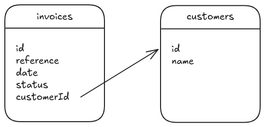

# Pagination with IndexedDB

> IndexedDB is a way for you to persistently store data inside a user's browser. Because it lets you create web applications with rich query abilities regardless of network availability, these applications can work both online and offline. IndexedDB is useful for applications that store a large amount of data (for example, a catalog of DVDs in a lending library) and applications that don't need persistent internet connectivity to work (for example, mail clients, to-do lists, and notepads).

Reference: https://developer.mozilla.org/en-US/docs/Web/API/IndexedDB_API 

Let's review several options to query IndexedDB, in order to build a component that's quite common in most apps: a data table


Table of contents:

<!-- TOC -->
* [Option #1: `store.getAll()`](#option-1-storegetall)
* [Option #2: `index.getAll()`](#option-2-indexgetall)
* [Option #3: `index.openCursor()`](#option-3-indexopencursor)
* [Option #4: `index.openCursor()` without the total number of items](#option-4-indexopencursor-without-the-total-number-of-items)
* [Option #5: `index.openCursor()` with multiple indexes](#option-5-indexopencursor-with-multiple-indexes)
* [Option #6: bulk iteration with `index.getAll(query, count)`](#option-6-bulk-iteration-with-indexgetallquery-count)
* [Option #7: use server-side pagination](#option-7-use-server-side-pagination)
<!-- TOC -->

DB schema:

<picture>
  <source media="(prefers-color-scheme: dark)" srcset="./assets/schema-dark.png">
  
</picture>

You can find a complete example displaying all options based on [Vue.js](https://vuejs.org/) and [Vuetify](https://vuetifyjs.com/) in the `vuejs-example/` directory:

```
$ cd vuejs-example
$ npm install
$ npm run dev
```

Note: in the code examples, we use the [`idb` library](https://github.com/jakearchibald/idb), which is the sanest way to work with IndexedDB.

## Option #1: `store.getAll()`

The naive solution is to load every invoice in memory:

```js
async function loadItems() {
  const db = await getDB();
  const items = await db.getAll("invoices");

  return items;
}
```

Reference: [IDBObjectStore.getAll()](https://developer.mozilla.org/en-US/docs/Web/API/IDBObjectStore/getAll)

Pros:

- `store.getAll()` is quite efficient to load lots of entities from the object store
- the component takes care of the pagination and ordering

Cons:

- this solution will not scale well, as everything is done in memory (not suitable for > 10k objects)


## Option #2: `index.getAll()`

Let's move some filtering to the storage engine with two [indexes](https://developer.mozilla.org/en-US/docs/Web/API/IDBIndex):

```js
async function loadItems(filters) {
  const db = await getDB();
  let items;

  if (filters.customerId) {
    items = await db.getAllFromIndex("invoices", "by-customer", filters.customerId);
  } else {
    const promises = [];
    if (filters.status.draft) {
      promises.push(db.getAllFromIndex("invoices", "by-status", "draft"));
    }
    if (filters.status.edited) {
      promises.push(db.getAllFromIndex("invoices", "by-status", "edited"));
    }
    if (filters.status.paid) {
      promises.push(db.getAllFromIndex("invoices", "by-status", "paid"));
    }
    const results = await Promise.all(promises);
    items = results.reduce((arr, elem) => {
      arr.push(...elem)
      return arr;
    }, []);
  }

  return items;
}
```

Reference: [IDBIndex.getAll()](https://developer.mozilla.org/en-US/docs/Web/API/IDBIndex/getAll)

Note: there is no `IN` criteria in the IndexedDB API, only [key ranges](https://developer.mozilla.org/en-US/docs/Web/API/IDBKeyRange), so we could have written:

```js
// "draft" or "edited"
db.getAllFromIndex("invoices", "by-status", IDBKeyRange.bound("draft", "edited"));

// "edited" or "paid"
db.getAllFromIndex("invoices", "by-status", IDBKeyRange.bound("edited", "paid"));

// loads everything, as "edited" comes between "draft" and "paid" in the lexicographic order
db.getAllFromIndex("invoices", "by-status", IDBKeyRange.bound("draft", "paid"));
```

Pros:

- `index.getAll()` is quite efficient to load lots of entities from the object store (and we load fewer objects than with `store.getAll()`)
- the component takes care of the pagination and ordering

Cons:

- this solution will not scale well, as almost everything is done in memory (not suitable for > 10k objects)


## Option #3: `index.openCursor()`

IndexedDB let us create a cursor over an index, and iterate over it:

```js
async function loadItems(filters, options) {
  function matches(item) {
    const matchesReference =
      !filters.search || item.reference.includes(filters.search);
    const matchesCustomerId =
      !filters.customerId || filters.customerId === item.customerId;
    const matchesStatus = filters.status[item.status];

    return matchesReference && matchesCustomerId && matchesStatus;
  }
  
  const items = [];
  let totalItems = 0;

  const db = await getDB();
  const tx = db.transaction(["invoices"], "readonly");
  let index;

  switch (options.sortBy[0].key) {
    case "reference":
      index = tx.objectStore("invoices").index("by-reference");
      break;
    default:
      index = tx.objectStore("invoices").index("by-date-reference");
      break;
  }
  const direction = options.sortBy[0].order === "asc" ? "next" : "prev";

  for await (const cursor of index.iterate(null, direction)) {
    const item = cursor.value;

    if (!matches(item)) {
      continue;
    }

    totalItems++;

    const shouldSkip =
      totalItems <= (options.page - 1) * options.itemsPerPage ||
      items.length === options.itemsPerPage;

    if (shouldSkip) {
      continue;
    }

    items.push(item);
  }

  return {
    items,
    totalItems,
  }
}
```

Reference: [IDBIndex.openCursor()](https://developer.mozilla.org/en-US/docs/Web/API/IDBIndex/openCursor)

Pros:

- we only load the entities that will be displayed in the table

Cons:

- we still need to iterate over the whole index (full table scan) to compute the total number of matching items, which is really slow (a lot slower that using `getAll()` and computing everything in memory)
- filtering by reference or by customer is slow as well


## Option #4: `index.openCursor()` without the total number of items

If we don't need the total number of matching items, we can short-circuit the iteration and quickly return the list of items:

```js
async function loadItems(filters, options) {
  function matches(item) {
    const matchesReference =
      !filters.search || item.reference.includes(filters.search);
    const matchesCustomerId =
      !filters.customerId || filters.customerId === item.customerId;
    const matchesStatus = filters.status[item.status];

    return matchesReference && matchesCustomerId && matchesStatus;
  }
  
  const items = [];
  let hasMore = false;
  let totalItems = 0;

  const db = await getDB();
  const tx = db.transaction(["invoices"], "readonly");
  let index;

  switch (options.sortBy[0].key) {
    case "reference":
      index = tx.objectStore("invoices").index("by-reference");
      break;
    default:
      index = tx.objectStore("invoices").index("by-date-reference");
      break;
  }
  const direction = options.sortBy[0].order === "asc" ? "next" : "prev";

  for await (const { value } of index.iterate(null, direction)) {
    if (!matches(value)) {
      continue;
    }

    totalItems++;

    const shouldSkip = totalItems <= (options.page - 1) * options.itemsPerPage;

    if (shouldSkip) {
      continue;
    }

    if (items.length < options.itemsPerPage) {
      items.push(value);
    } else {
      hasMore = true;
      break;
    }
  }

  return {
    items,
    hasMore,
  };
}
```

Pros:

- we only load the entities that will be displayed in the table

Cons:

- filtering by reference or by customer is slow


## Option #5: `index.openCursor()` with multiple indexes

To make filtering by reference or by customer faster, we need additional indexes:

```js
async function loadItems(filters, options) {
  function matches(item) {
    const matchesReference =
      !filters.search || item.reference.includes(filters.search);
    const matchesCustomerId =
      !filters.customerId || filters.customerId === item.customerId;
    const matchesStatus = filters.status[item.status];

    return matchesReference && matchesCustomerId && matchesStatus;
  }

  const items = [];
  let totalItems = 0;
  let hasMore = false;

  const db = await getDB();
  const tx = db.transaction(["invoices"], "readonly");

  let index;
  let iterator;
  const direction = options.sortBy[0].order === "asc" ? "next" : "prev";

  if (filters.search) {
    index = tx.objectStore("invoices").index("by-reference");
    iterator = index.iterate(
      IDBKeyRange.bound(filters.search, filters.search + "\uffff"),
      direction,
    );
  } else if (filters.customerId) {
    switch (options.sortBy[0].key) {
      case "reference":
        index = tx.objectStore("invoices").index("by-customer-reference");
        break;
      default:
        index = tx.objectStore("invoices").index("by-customer-date-reference");
        break;
    }
    iterator = index.iterate(
      IDBKeyRange.bound([filters.customerId], [filters.customerId, [], []]),
      direction,
    );
  } else {
    switch (options.sortBy[0].key) {
      case "reference":
        index = tx.objectStore("invoices").index("by-reference");
        break;
      default:
        index = tx.objectStore("invoices").index("by-date-reference");
        break;
    }
    iterator = index.iterate(null, direction);
  }

  for await (const { value } of iterator) {
    if (!matches(value)) {
      continue;
    }

    totalItems++;

    const shouldSkip = totalItems <= (options.page - 1) * options.itemsPerPage;

    if (shouldSkip) {
      continue;
    }

    if (items.length < options.itemsPerPage) {
      items.push(value);
    } else {
      hasMore = true;
      break;
    }
  }

  return {
    items,
    hasMore,
  };
}
```

Notes:

- when searching by reference, we compute the upper bound based on the user input
- when searching by customer, we use an empty array as the upper bound, as it's greater than any string [per the spec](https://w3c.github.io/IndexedDB/#key-construct)

Pros:

- we only load the entities that will be displayed in the table
- filtering by reference or by customer is fast

Cons:

- we need a lot of indexes (# of criteria * # of sorting option)


## Option #6: bulk iteration with `index.getAll(query, count)`

Iterating with a cursor over a lot of documents is quite slow and can be made faster with `store.getAll(query, count)`:

```js
function bulkIterate (index, query, direction, bulkSize) {
  if (direction !== "next") {
    return index.iterate(query, direction);
  }

  return (async function*() {
    let offset = query;

    while (true) {
      const items = await index.getAll(offset, bulkSize);

      if (items.length === 0) {
        break;
      }

      for (const item of items) {
        yield { value: item };
      }

      const lastItem = items[items.length - 1];
      const lastItemId = Array.isArray(index.keyPath) ? index.keyPath.map((k) => lastItem[k]) : lastItem[index.keyPath];

      if (query instanceof IDBKeyRange && query.upper !== undefined) {
        offset = IDBKeyRange.bound(lastItemId, query.upper, true, query.upperOpen);
      } else {
        offset = IDBKeyRange.lowerBound(lastItemId, true);
      }
    }
  })();
}

async function loadItems(filters: Filters, options: Options) {
  function matches(item: Invoice) {
    const matchesReference =
      !filters.search || item.reference.includes(filters.search);
    const matchesCustomerId =
      !filters.customerId || filters.customerId === item.customerId;
    const matchesStatus = filters.status[item.status];

    return matchesReference && matchesCustomerId && matchesStatus;
  }

  const items = [];
  let totalItems = 0;
  let hasMore = false;

  const db = await getDB();
  const tx = db.transaction(["invoices"], "readonly");

  let index;
  let iterator;
  const direction = options.sortBy[0].order === "asc" ? "next" : "prev";
  const bulkSize = 2 * options.itemsPerPage; // some items will be filtered

  if (filters.search) {
    index = tx.objectStore("invoices").index("by-reference");
    iterator = bulkIterate(index,
      IDBKeyRange.bound(filters.search, filters.search + "\uffff"),
      direction,
      bulkSize
    );
  } else if (filters.customerId) {
    switch (options.sortBy[0].key) {
      case "reference":
        index = tx.objectStore("invoices").index("by-customer-reference");
        break;
      default:
        index = tx.objectStore("invoices").index("by-customer-date-reference");
        break;
    }
    iterator = bulkIterate(
      index,
      IDBKeyRange.bound([filters.customerId], [filters.customerId, [], []]),
      direction,
      bulkSize,
    );
  } else {
    switch (options.sortBy[0].key) {
      case "reference":
        index = tx.objectStore("invoices").index("by-reference");
        break;
      default:
        index = tx.objectStore("invoices").index("by-date-reference");
        break;
    }
    iterator = bulkIterate(index, null, direction, bulkSize);
  }

  for await (const { value } of iterator) {
    if (!matches(value)) {
      continue;
    }

    totalItems++;

    const shouldSkip = totalItems <= (options.page - 1) * options.itemsPerPage;

    if (shouldSkip) {
      continue;
    }

    if (items.length < options.itemsPerPage) {
      items.push(value);
    } else {
      hasMore = true;
      break;
    }
  }

  return {
    items,
    hasMore,
  };
}
```

Note: this only works when sorting in ascending order, as `index.getAll(query, count)` does not support providing a `direction` option like with `index.openCursor(range, direction)`.

Related: https://github.com/w3c/IndexedDB/issues/130


## Option #7: use server-side pagination

Or, instead of implementing a query planner on our own, we can query the server and let the one provided with our DBMS do the hard work:

```js
function loadItems(filters, options) {
  return axios.get(`/invoices?p=${options.page}&...`);
}
```

Cons:

- this won't work offline


That's all folks, thanks for reading!

[^ Back to the top](#pagination-with-indexeddb)
